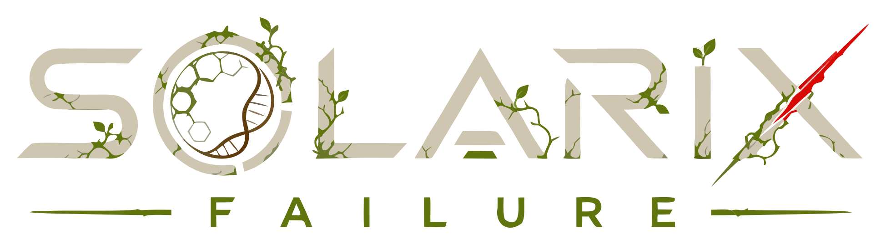

<div align="center">
  

  <p><strong>Build a refuge. Survive the swarm. Fight for your clan.</strong></p>

  <p>
    
    
    
    
  </p>
</div>

## About

**Solarix: Failure** is an open-source Godot game that combines strategic base management with bullet-heaven combat, clan warfare, survival systems, and an expanding world.

The project is currently in early alpha. Its direction includes:

- Building, maintaining, and defending a survivor base
- Large-scale bullet-heaven encounters against escalating threats
- Clan creation, rivalry, alliances, and territorial conflict
- Persistent progression, resources, upgrades, and difficult trade-offs
- Story-driven exploration of a world shaped by the Solarix failure
- Multiple survivor origins and evolving gameplay systems

## The Frontier AI Experiment

Solarix: Failure is also an experiment in frontier AI-assisted game development.

The project uses frontier AI agents as active development collaborators and pushes them toward their practical limits across architecture, programming, interface design, content production, testing, documentation, and iteration. The purpose is to observe what these systems can produce, where they fail, how they recover, and how far a coherent game can be developed through a deliberately constrained workflow:

- **Human inputs:** vision, goals, constraints, feedback, taste, and final decisions
- **AI outputs:** implementations, assets, systems, revisions, tests, and documentation

The repository preserves the outcomes of that process—successful, imperfect, and experimental—as part of the project itself.

## Technology

- [Godot Engine 4.7](https://godotengine.org/) with C# support
- C# and .NET 10
- Godot scenes, resources, localization, and audio systems
- Frontier AI agents used throughout the development workflow

## Getting Started

1. Install Godot 4.7 with .NET/C# support and the .NET 10 SDK.
2. Clone this repository:

   ```bash
   git clone https://github.com/Mw-Collective/Solarix-Failure.git
   cd Solarix-Failure
   ```

3. Open `project.godot` in Godot.
4. Allow Godot to import the assets and restore the C# project.
5. Run the project from the editor.

You can also verify the C# project from a terminal:

```bash
dotnet build SolarixFailure.sln
```

## Contributing and Experimenting

You are welcome to study, fork, modify, and redistribute the project under the terms of the GNU General Public License. Experiments, alternative systems, accessibility improvements, balancing work, and creative modifications are encouraged.

If you distribute a modified version, the GPL requires that it remain under the GPL and that its corresponding source be made available to its recipients. See [LICENSE](LICENSE) for the complete terms.

## Support the Project

If you would like to support continued development, you can donate **USDT on the TRON network (TRC-20)**.

**Address:** `TAQZKXukBavfGQW2f2qpM1hkXbNiDMv6x1`

<p align="center">
  
  <br>
  <strong>USDT · TRON (TRC-20)</strong>
</p>

> Always verify that the selected network is **TRON (TRC-20)** and that the address matches before sending. Cryptocurrency transfers are irreversible.

## License

Solarix: Failure is licensed under the [GNU General Public License v3.0 or later](LICENSE). You may use, study, modify, and redistribute the project—including commercially—provided you follow the GPL's terms. Distributed derivative works must remain under the GPL and provide their corresponding source to recipients.
